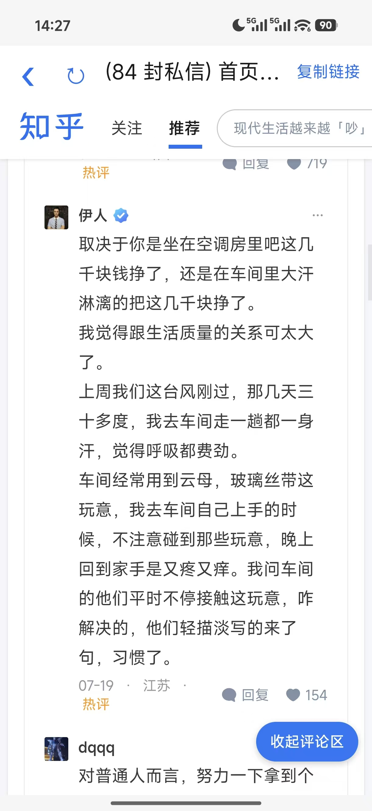

# 知乎简洁版

这是一个仅供个人使用的轻量 Android 客户端，目标设备为小米 17。它不依赖知乎官方 API，不收集知乎密码，通过知乎网页完成登录、浏览首页、阅读回答和查看评论。



## 下载

[下载知乎简洁版 v1.12 APK](https://github.com/mms-0405/zhihu-lite/releases/download/v1.12/zhihu-lite-v1.12.apk)


## 当前功能

- 在 WebView 中浏览知乎首页、关注与推荐内容
- 保留知乎网页登录状态，Cookie 仅由系统 WebView 管理
- 将桌面版页面调整为适合手机阅读的单栏布局
- 提高回答与评论文字的可读性，并支持双指缩放
- 补充“阅读全文”入口，展开后可快速收起回答
- 评论区展开后提供常驻“收起评论区”按钮
- 个人主页补充“关注的人”和“关注者”入口
- 隐藏客户端推广按钮、横幅和无关弹窗
- 拦截跳转知乎客户端的链接及部分统计请求
- 提供返回、刷新和复制当前链接操作
- 非知乎网页交给系统浏览器打开

## 构建

需要 Android Studio，或 JDK 17、Gradle 8.9、Android SDK Platform 35。克隆到不含中文的路径后，在项目根目录执行：

```bash
gradle :app:assembleRelease
```

构建产物位于 `app/build/outputs/apk/release/app-release.apk`。项目最低支持 Android 6.0（API 23），目标版本为 Android 15（API 35）。

应用图标由 `apk图标.jpg` 生成。如需更换图标，覆盖原图、调整 `tools/make-icon.py` 中的裁切参数，然后执行：

```bash
python tools/make-icon.py
```

## 安装校验

v1.12 APK 的 SHA-256：

```text
6C4F079C89DFF93649B0E2499E6DAB60C2EB317F1EF29ACC8B2B832E2AB884FE
```

## 重要限制

知乎网页改版、登录风控或验证码可能影响功能。页面整理规则依赖知乎当前网页结构，若网页结构变化，部分按钮或布局可能需要更新。

本项目是非官方个人项目，与知乎无隶属或授权关系。“知乎”及相关标识归其权利人所有。
