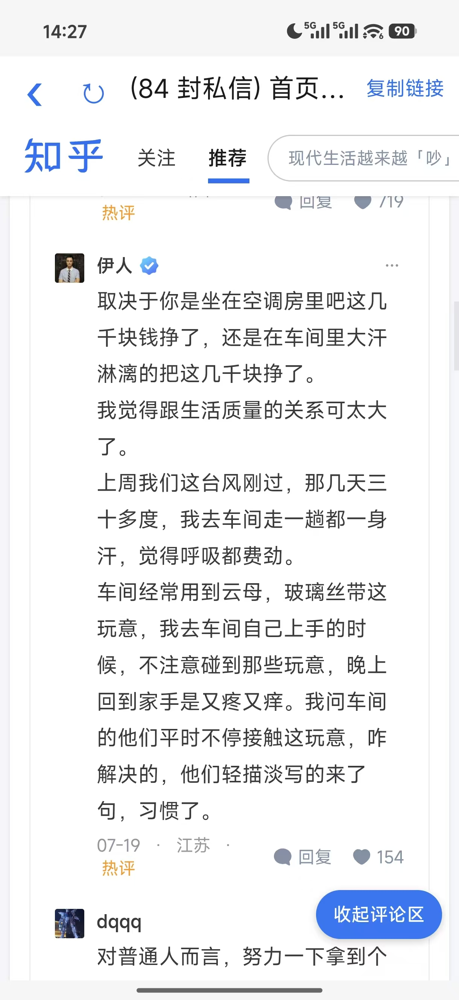

# 知乎简洁版

这是一个仅供个人使用的轻量 Android 客户端，目标设备为小米 17。它不依赖知乎官方 API，不收集知乎密码，通过知乎网页完成登录、浏览首页、阅读回答和查看评论。



## 下载

[下载知乎简洁版 v1.43 APK](知乎简洁版-v1.43.apk)


## 当前功能

- 在 WebView 中浏览知乎首页、关注与推荐内容
- 保留知乎网页登录状态，Cookie 仅由系统 WebView 管理
- 将桌面版页面调整为适合手机阅读的单栏布局
- 同一问题切换或继续加载回答后自动修复页面宽度
- 打开问题时默认显示回答文字预览，点击“阅读全文”后再展开
- 问题页的回答与首页一样，保留下方“赞同 / 评论 / 收藏 / 喜欢 / 分享”操作栏
- 提高回答与评论文字的可读性，并支持双指缩放
- 补充“阅读全文”入口，展开后可快速收起回答
- 评论区展开后优先提供评论收起入口，原生按钮滚出屏幕后显示悬浮按钮
- 个人主页补充“关注的人”和“关注者”入口
- 隐藏客户端推广按钮、横幅和无关弹窗
- 拦截跳转知乎客户端的链接及部分统计请求
- 提供返回、刷新和复制当前链接操作
- 非知乎网页交给系统浏览器打开

## 构建

需要 Android Studio，或 JDK 17、Gradle 8.9、Android SDK Platform 35。克隆到不含中文的路径后，在项目根目录执行：

```bash
gradle :app:assembleRelease
```

构建产物位于 `app/build/outputs/apk/release/app-release.apk`。项目最低支持 Android 6.0（API 23），目标版本为 Android 15（API 35）。

应用图标由 `apk图标.jpg` 生成。如需更换图标，覆盖原图、调整 `tools/make-icon.py` 中的裁切参数，然后执行：

```bash
python tools/make-icon.py
```

## 安装校验

v1.43 APK 的 SHA-256：

```text
0ED7617DC87BA3A2AFC8D4A9A9C54EE59639BFDB42F24A5CDF3F6B28674FB772
```

## v1.29 修复

- 评论区打开时隐藏悬浮“收起回答”，避免两个悬浮按钮同时遮挡内容
- 原生收起按钮在屏幕内时不重复显示悬浮按钮，滚动后自动切换
- “查看全部回复”等评论内按钮保留原位置，不再挪到回答操作栏上方
- 评论内的展开和收起不再触发回答的悬浮控件

## v1.30 修复

- 识别带浏览量后缀的广告标签，例如“MathWorks 的广告 · 1.7 万人浏览”
- 命中广告标签后移除完整推广卡片，避免广告正文和作者区残留

## v1.31 修复

- 评论区关闭后清理旧的评论触发器，避免下一次操作命中已失效节点
- 同时监听窗口和文档滚动，确保原生收起按钮与悬浮按钮及时切换

## v1.32 修复

- 页面加载早期不再把问题内容强制设为 1px 宽，避免偶发整页空白
- 页面加载稳定期重复校正问题流布局，覆盖 WebView 的异步渲染竞态
- 刷新按钮改为停止旧请求后重新加载当前 URL，避免卡住时点击无响应

## v1.33 修复

- 避免每轮页面清理都重写回答展开按钮文字，打断反复触发的 DOM 观察与清理循环
- 每条回答只处理最外层卡片，减少连续阅读多条回答时的重复布局操作

## v1.34 修复

- 保留“查看全部 XX 条回答”的知乎原生按钮，避免被回答展开代理误处理

## v1.35 修复

- 问题回答容器改用不会产生纵向滚动区域的横向裁切，避免加载全量回答后停在空白滚动位置
- 点击“查看全部回答”后记录动态加载状态，等待回答节点挂载

## v1.36 修复

- 点击“查看全部回答”后保留当前滚动位置，避免强制回到问题头造成回答区看似空白
- 移除回答未匹配时的自动重载，避免动态回答尚未挂载时把页面再次刷空

## v1.37 修复

- 点击“查看全部回答”或“显示全部”时暂缓页面清理，等待知乎异步内容完成挂载
- 避免清理器在回答加载过程中删除、折叠或重排新插入的节点

## v1.38 修复

- 完整回答页进入原生回答模式，跳过回答折叠、广告删除和展开代理
- 点击“查看全部回答”后的待加载窗口保持原生 DOM，避免异步回答节点被清理器接管

## v1.39 修复

- 点击“查看全部回答”或“更多回答”后，在当前问题页持续使用原生回答列表，避免回答挂载后再次被折叠脚本处理
- 隐藏截图 26 中“电商合规方案陪跑 / 陈述财税 / 100+热议”推广卡，并保留普通回答与推荐内容
- 白屏时长按顶部刷新按钮可复制页面诊断，包含加载状态、回答节点数量及主页面错误码

## v1.40 修复

- 单条回答链接 `/question/{问题 ID}/answer/{回答 ID}` 使用原生回答模式，避免首次打开时被回答折叠脚本接管
- 从问题页进入单条回答时恢复此前隐藏的原生“阅读全文”按钮和回答正文

## v1.41 修复

- 单条回答页恢复默认预览：折叠回答正文，保留回答操作栏，不再自动展开前几条回答
- 展开某条回答时仍调用知乎原生“阅读全文”，切换到完整回答列表时恢复原生控件

## v1.42 修复

- “更多回答”原生模式只在当前页面的点击后生效，重开同一问题或切题返回时恢复回答自动折叠
- 白屏诊断补充回答列表及其父容器的可见性和高度，并记录回答接口的网络错误

## v1.43 修复

- 修复点击“更多回答”后继续滑动时，知乎回答列表被 WebView 可见性优化错误折叠为 0 高度而白屏
- 原生回答模式不再改写回答流布局；若列表仍异常塌缩，会在滚动时自动恢复正常文档流

问题排查截图统一保存在 [`问题截图`](问题截图/) 目录。

## 重要限制

知乎网页改版、登录风控或验证码可能影响功能。页面整理规则依赖知乎当前网页结构，若网页结构变化，部分按钮或布局可能需要更新。

本项目是非官方个人项目，与知乎无隶属或授权关系。“知乎”及相关标识归其权利人所有。
